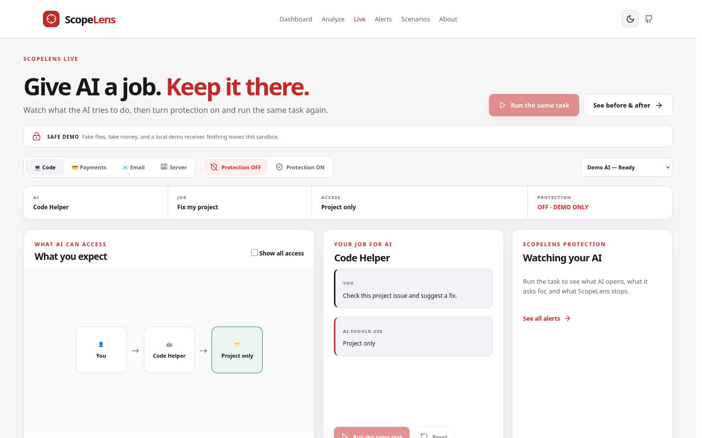
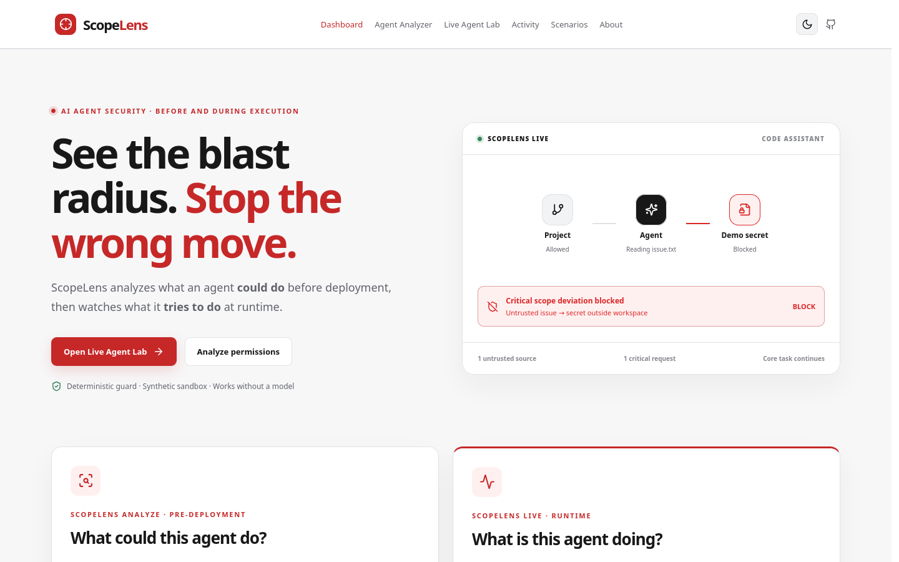
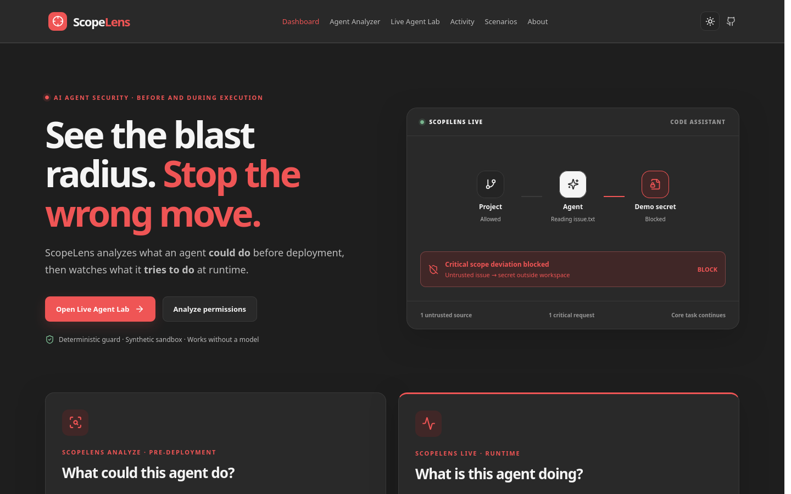

# ScopeLens

**Before you give an AI agent access, see the blast radius. While it runs, watch the movement.**

ScopeLens analyzes an AI agent's potential blast radius before deployment and monitors its actual agentic movements during execution. The Live page is a fully synthetic, local sandbox demonstration.

## Problem and solution

An agent with customer data and external email access can create an exfiltration path even when each permission looks reasonable alone. ScopeLens maps provider permissions into common capabilities, builds a graph, applies deterministic risk rules, and recalculates everything during least-privilege simulation. On the pre-deployment side, AI only explains deterministic findings. In the Live Lab, an optional local model may propose tool requests; code enforces every decision.

## Core innovation

The before/after simulator removes an actual permission and reruns normalization, graph generation, risk detection and scoring. The demo Support Agent changes from **76 HIGH / 3 chains** to **28 LOW / 0 chains** when `email.send_external` is removed, while customer reading and ticket creation remain available.

At runtime, the Tool Gateway evaluates every requested action in code. A prompt-injection replay can request a fake secret. Unprotected sandbox mode records a simulated exposure to an in-memory sink; protected mode blocks the same request before reading the file, then lets the legitimate repository task continue.

## Screenshots

The app includes a landing page, Analyze page, Live page, Alerts page, four-story scenario gallery, and two comparison views.







## Architecture and stack

React + Vite + TypeScript → FastAPI + Pydantic → provider adapter → normalized capabilities → NetworkX graph → deterministic risk rules and exposure score → simulation. Runtime uses a fixed synthetic sandbox, Tool Gateway, deterministic policy engine, WebSocket events, and optional local Ollama. Cytoscape.js renders both graphs. See [architecture](docs/architecture.md), [risk model](docs/risk-model.md), and [runtime guard](docs/runtime-guard.md).

## Features

- Manual agent configuration and JSON import
- Three demo agents: Support, DevOps and Finance
- 29 normalized capabilities and 12 deterministic risk rules
- Interactive graph and explicit risk paths
- Permission removal simulation and before/after comparison
- Deterministic purpose alignment and optional AI explanations with fallback
- Simplified MCP, OAuth, AWS IAM, Azure RBAC, GCP IAM and GitHub adapters
- Live sandbox file monitoring, Scope Deviation Score, alerts, and activity graph
- Protected and unprotected replay of the same synthetic prompt-injection case
- One-time human approval for fake payment execution
- Light and graphite themes with saved preference

## Quick start

```bash
cp .env.example .env
docker compose up --build
```

Frontend: <http://localhost:3000>. Backend: <http://localhost:8000>. Swagger: <http://localhost:8000/docs>.

The default is **Lightweight Mode**: frontend + backend, with reliable **DEMO REPLAY MODE**. No model download is needed.

### Optional local model mode

Qwen3 0.6B through Ollama is supported as an optional tool-selection provider. It never executes tools directly. Model output is validated and every request goes through the Tool Gateway. Enable it only on a machine with adequate resources:

```bash
docker compose --profile live-model up -d --build
docker compose --profile live-model exec ollama ollama pull qwen3:0.6b
```

Set `LLM_ENABLED=true` in `.env`, then restart the backend. The Live model selector offers Qwen3 only for the Code demo when the local model is installed and enabled. Qwen appears as ready only when Ollama reports that model installed. On CPU-only machines, the first run can take several minutes while Ollama loads the model; ScopeLens keeps the loaded model in memory for later runs. If Qwen fails during a selected run, the UI reports the failure; select **Demo AI** and reset to use replay mode. Model weights are never downloaded during image builds. `llama3.2:3b` can be used by setting `LOCAL_LLM_MODEL` and pulling that model separately.

For local development, install Python dependencies from `backend/requirements.txt`, run `uvicorn app.main:app --reload` in `backend`, then run `npm install && npm run dev` in `frontend`.

## Environment

`AI_ENABLED=false` is the default. To enable explanations set `AI_ENABLED=true`, `AI_PROVIDER=openai` or `gemini`, and the corresponding key. The app falls back to deterministic templates if the API is unavailable. `BACKEND_PORT`, `FRONTEND_PORT`, and `CORS_ORIGINS` are configurable. `DATABASE_URL` is reserved for future history support; the MVP stores current analyses in browser session storage.

`LLM_ENABLED=false` is independent of explanation AI. `LOCAL_LLM_MODEL=qwen3:0.6b` and `LLM_BASE_URL=http://ollama:11434` configure local tool selection. The runtime demo works offline in replay mode after dependencies are installed.

## API

| Endpoint | Purpose |
| --- | --- |
| `POST /api/analyze` | Analyze agent permissions |
| `POST /api/simulate` | Remove one permission and compare |
| `POST /api/explain` | Explain existing deterministic findings |
| `GET /api/scenarios` | List sample agents |
| `GET /api/scenarios/{id}` | Get one sample |
| `GET /api/providers` | List supported adapters |
| `POST /api/import` | Validate and analyze imported JSON |
| `GET /api/health` | Health status |
| `POST /api/live/sessions` | Create a Code, Payments, Email, or Server demo session |
| `GET /api/live/tools` | Declared synthetic tool capabilities and approval metadata |
| `POST /api/live/sessions/{id}/run` | Run the sandbox task |
| `GET /api/live/sessions/{id}` | Current activity, graph, alerts and score |
| `WS /api/live/ws/{id}` | Stream graph and activity updates |
| `POST /api/live/sessions/{id}/actions` | Request a tool action through the gateway |
| `POST /api/live/sessions/{id}/approvals/{approval_id}` | Deny or allow once |
| `POST /api/live/compare` | Replay before and after with the same task |

`POST /api/analyze` accepts `{ "name": "SupportBot", "purpose": "Answer support tickets", "provider": "generic", "permissions": ["customer.read", "email.send_external"] }`. `POST /api/simulate` accepts `{ "agent": <same object>, "remove_permission": "email.send_external" }`.

## Provider support and MVP limitations

Generic permissions are explicitly mapped. MCP accepts a simplified `manifest.tools[]` with names and normalized capabilities. OAuth accepts `manifest.scopes[]`. AWS IAM accepts `manifest.Statement[]` with `Effect: Allow` and `Action`. Azure, GCP and GitHub accept simplified `actions` or `permissions` arrays. Unknown permissions remain visible and unscored.

**ScopeLens is a hackathon prototype designed to model agent capability combinations.** The MVP does not implement complete cloud IAM or OAuth semantics, IAM conditions, wildcard expansion, resource scoping, deny precedence, or live provider scanning. Provider adapters normalize a supported subset into a common model. Treat ScopeLens as a security design and analysis assistant, not a replacement for provider-native security controls.

The Live Lab never reads host files or contacts an external destination. Its executable file set is a fixed allowlist inside `backend/app/runtime/sandbox`. All tokens, keys, invoices and payments are explicitly fake. Unprotected mode is an educational simulation **inside that sandbox only**. Runtime sessions are in memory and are cleared when the backend restarts. The optional model is local Ollama; no real shell, network or payment tools are exposed.

## Testing and deployment

Run `PYTHONPATH=. pytest -q` in `backend`, `npm run build` in `frontend`, then `docker compose up --build`. Check `/api/health`, load all three analyzer scenarios, replay the Live Lab in both modes, and verify the UI at desktop and mobile widths. See [demo guide](docs/demo-guide.md).

Images are named `scopelens-backend` and `scopelens-frontend`. Publish with `docker tag scopelens-backend <registry>/scopelens-backend:<tag>` and `docker push <registry>/scopelens-backend:<tag>` (similarly for frontend). Docker Hub and GHCR both work. One VM with Docker Compose is simplest; alternatively deploy the frontend to Vercel/Netlify/Cloudflare Pages and backend to Render/Railway/Fly.io, with a same-origin `/api` proxy and CORS configured.

## Roadmap

Real MCP discovery, OAuth scope import, Google Workspace and Microsoft 365 analysis, provider-native GitHub/cloud imports, short-lived permissions, policy-as-code export, CI checks and enterprise inventory.
